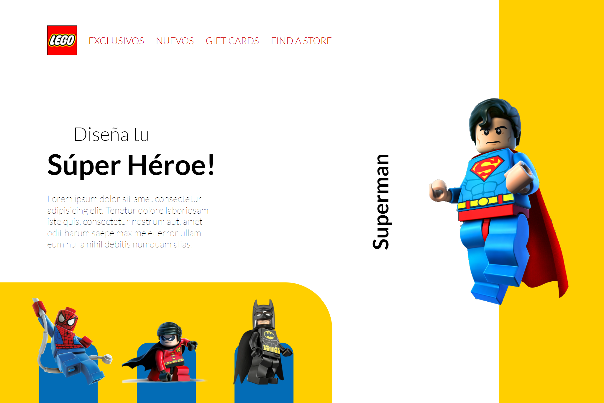

# LEGO Landing Page

## About the project

This is a LEGO landing page, it contains animations when the page loads. It also displays a modal when clicking one of the LEGO figures.

Live: https://rodedd.github.io/LEGO-landing-page/

### Built with

- HTML
  - Semantic HTML
- CSS
  - Grid
  - Flexbox
  - Keyframes
  - Variables
- JavaScript
  - DOM Manipulation
